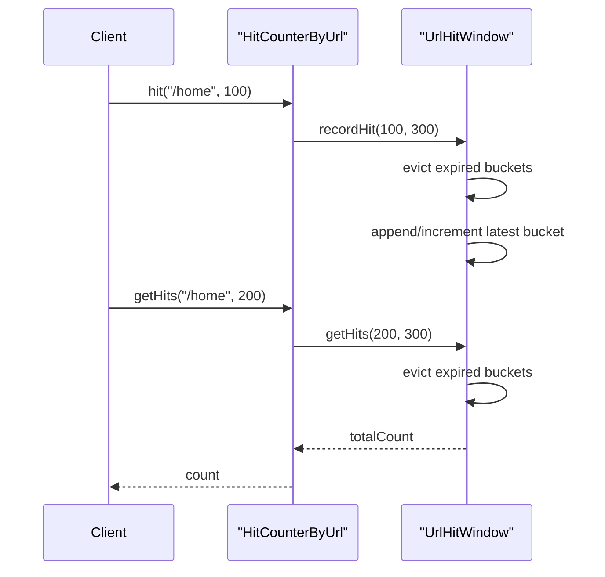

Notes:

Record Hit Counter

Read about the Instant use
Try to use 1,2,3, timestamp instead of using actual epoch time and divide by 1000 to convert from mills to second to have aggregation logic

computeIfAbsent , stores in map as well and work for non list as well
UrlHitWindow hitWindow = keyToWindow.computeIfAbsent(key, ignored -> new UrlHitWindow());
synchronized keyword apne aap mein ek lock ki tarah kaam karta hai.
Jab bhi koi thread synchronized method ke andar jata hai, toh Java automatically pichle saare CPU caches ko flush kar deta hai (jise "happens-before" relationship kehte hain).
Iska matlab hai ki synchronized humko visibility aur atomicity dono de deta hai, jabki volatile sirf visibility deta hai (atomicity nahi).

PeekLast vs PollLast


# Design Hit Counter

This package contains a simple in-memory hit counter for tracking hits per URL in the last 5 minutes.

This README is written in a way that you can first **read and understand the design**, then try to **convert it into code yourself**.

## Problem Statement

Design a hit counter system that supports:

- recording a hit for a URL at a given timestamp
- returning the number of hits for that URL in the last 5 minutes

Example APIs:

```java
hit(String url, int timestamp)
getHits(String url, int timestamp)
```

Assume:

- timestamp is given in seconds
- 5 minutes means `300 seconds`
- we only care about the last 300 seconds from the current timestamp

## Functional Requirements

- record a hit for a URL
- return recent hits for a URL
- count only hits in the last 5 minutes
- support multiple URLs independently
- keep solution fully in memory

## Non-Functional Expectations

- simple and clean LLD
- easy to explain in interview
- efficient enough for many hit operations
- avoid recalculating the full count every time

## APIs

### `hit(String url, int timestamp)`

- records one hit for the given URL
- if multiple hits come in the same second, they should be grouped together

### `getHits(String url, int timestamp)`

- returns number of hits for that URL in the last 300 seconds
- if URL does not exist, return `0`

## Key Observation

We do not need to store every individual hit separately.

If 10 hits come for `/home` at timestamp `100`, we can store:

```text
(100, 10)
```

instead of storing 10 separate entries.

That leads us to a **bucket-based sliding window** design.

## Chosen Approach

For every URL, maintain:

- a `Deque<Bucket>`
- a running `totalCount`

Each `Bucket` stores:

- `timestamp`
- `count`

Before doing either `hit()` or `getHits()`:

- remove all expired buckets from the front

Expired means:

```text
bucket.timestamp <= currentTimestamp - 300
```

After cleanup:

- `hit()` adds to the last bucket if same timestamp
- otherwise creates a new bucket at the end
- `getHits()` directly returns `totalCount`

## Why Deque?

Deque is a very natural fit because:

- newest timestamps are added at the back
- oldest expired timestamps are removed from the front

So the structure behaves like a sliding time window.

## Data Model

### `Bucket`

Represents hit count for one timestamp.

Fields:

- `timestamp`
- `count`

### `UrlHitWindow`

Represents the sliding window for one URL.

Fields:

- `Deque<Bucket> buckets`
- `int totalCount`

Responsibilities:

- evict old buckets
- record hit
- return recent hit count

### `HitCounter`

Interface for main operations:

- `hit(key, timestamp)`
- `getHits(key, timestamp)`

### `HitCounterByUrl`

Main implementation.

Fields:

- `Map<String, UrlHitWindow> keyToWindow`
- `windowSizeInSeconds`

Responsibilities:

- get/create per-URL counter
- delegate hit and read operations

## Flow of `hit(url, timestamp)`

1. find the hit window for the URL
2. if not present, create one
3. evict old buckets
4. if last bucket has same timestamp, increment count
5. else append a new bucket
6. increment running total

## Flow of `getHits(url, timestamp)`

1. find the hit window for the URL
2. if not present, return `0`
3. evict old buckets
4. return `totalCount`

## Sequence Diagram



## Time Complexity

### `hit()`

- amortized `O(1)`

### `getHits()`

- amortized `O(1)`

Reason:

- each bucket is inserted once
- each bucket is removed once

## Space Complexity

For each URL:

- at most one bucket per second in the active 5-minute window

So worst case:

- `O(300)` buckets per URL

## Interview Explanation

If interviewer asks, explain it like this:

> For every URL, I keep a deque of timestamp buckets and a running total. Before every read or write, I evict expired buckets older than 5 minutes. That way, `getHits()` does not need to iterate over the whole structure and can return the running total directly.

## Hinglish Memory Trick

Remember this:

`URL -> deque -> old hatao -> same second merge karo -> total do`

Or even shorter:

`back se add, front se remove, beech ka total maintain`

## Edge Cases

- URL not found -> return `0`
- multiple hits in same second -> merge into same bucket
- timestamps older than 5-minute window -> remove
- invalid key -> throw exception

## What You Should Read First

If you want to learn this and write code yourself, read in this order:

1. `Bucket`
   - one timestamp, one count
2. `UrlHitWindow`
   - real sliding window logic lives here
3. `HitCounter`
   - clean contract
4. `HitCounterByUrl`
   - map of URL to sliding window
5. `Main`
   - example usage

## Files in This Package

- `/Users/sajalagrawal/Documents/LLD/src/main/java/companiesProblem/uber/lld/designHitCounter/Bucket.java`
- `/Users/sajalagrawal/Documents/LLD/src/main/java/companiesProblem/uber/lld/designHitCounter/UrlHitWindow.java`
- `/Users/sajalagrawal/Documents/LLD/src/main/java/companiesProblem/uber/lld/designHitCounter/HitCounter.java`
- `/Users/sajalagrawal/Documents/LLD/src/main/java/companiesProblem/uber/lld/designHitCounter/HitCounterByUrl.java`
- `/Users/sajalagrawal/Documents/LLD/src/main/java/companiesProblem/uber/lld/designHitCounter/Main.java`

## How to Convert This to Code Yourself

Write in this order:

1. `Bucket`
2. `UrlHitWindow`
   - `recordHit()`
   - `getHits()`
   - `evictExpired()`
3. `HitCounter` interface
4. `HitCounterByUrl`
5. `Main`

That order makes the implementation feel very natural.

## Future Extensions

- thread-safe version
- global hit counter
- top K URLs
- support arbitrary time windows
- support both per-user and per-URL counters
