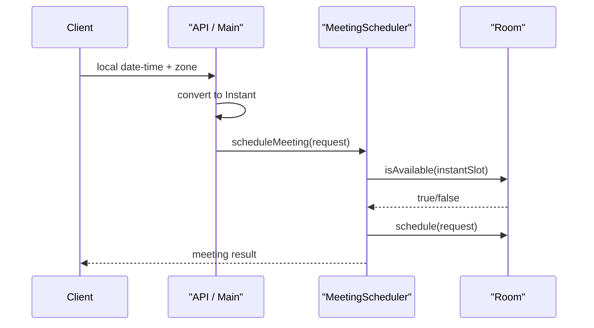

# Meeting Room Using Instant

This package is the same simple room-booking design as
`/Users/sajalagrawal/Documents/LLD/src/main/java/companiesProblem/uber/lld/meetingroom`,
but all time calculation and storage uses `Instant`.

## Why This Version Exists

`LocalDateTime` is good for interview simplicity, but it does not represent a global moment by itself.

`Instant` helps when:

- multiple regions are involved
- server timezone should not affect comparisons
- storage should be unambiguous
- API boundary receives local time and timezone separately

## Core Rule

- convert local user input to `Instant` at the boundary
- do overlap checks and storage using `Instant`

## Classes

- `TimeSlot`
  - stores `Instant start` and `Instant end`
- `MeetingRequest`
  - request object
- `Meeting`
  - final scheduled meeting
- `Room`
  - uses `TreeMap<Instant, Meeting>`
- `MeetingScheduler`
  - finds room and schedules meeting
- `NotificationService`
  - notification abstraction

## Approach

The design still uses range query with `TreeMap`:

- `floorEntry(start)`
- `ceilingEntry(start)`

That part stays the same.
Only the time type changes from `LocalDateTime` to `Instant`.

## Memory Line

`Local input lo -> Instant me convert karo -> Instant pe compare karo`

## Example Boundary Conversion

```java
LocalDateTime.of(2026, 4, 10, 10, 0)
    .atZone(ZoneId.of("Asia/Kolkata"))
    .toInstant();
```

## Sequence Diagram



## When To Use This

Use this design when you want to say in interview:

> I am taking local input at the edge, but internally I store and compare booking times using `Instant` to avoid timezone ambiguity.
