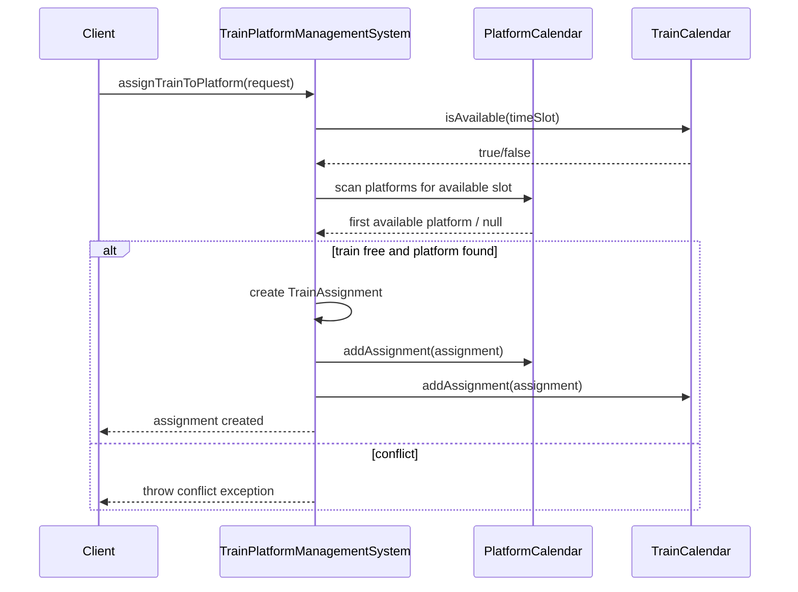
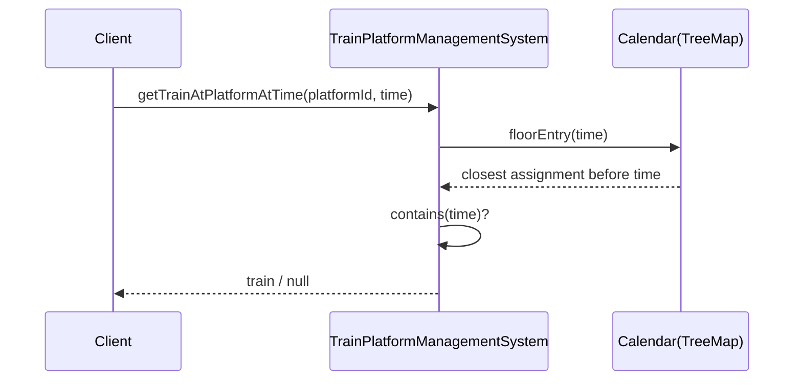

# Train Platform Management System

## Problem
Design a Train-Platform Management System.

Requirements:
- assign trains to platforms
- query which train is at a given platform at a given time
- query which platform a given train is at at a given time
- code should be runnable
- design patterns and class interactions explainable hone chahiye

## Final chosen approach
Ye problem meeting room wale range-query approach jaisa hi hai.

Humne same idea reuse kiya:
- har `Platform` ka apna `TreeMap` calendar
- har `Train` ka apna `TreeMap` calendar
- start time pe index karenge
- `floorEntry()` use karke quickly relevant assignment nikaalenge

This keeps the code:
- easy to remember
- easy to explain
- easy to query in both directions

## Why two calendars?
Agar sirf platform calendar rakhoge:
- "T1 kis platform pe hai at 10:10?" query slow ho jayegi

Agar sirf train calendar rakhoge:
- "P1 pe kaunsi train hai at 10:10?" query slow ho jayegi

So best approach:
- platform side index
- train side index

Memory line:

`Platform se train dekho, train se platform dekho`

## Core classes
- `TimeSlot`
- `Train`
- `Platform`
- `TrainAssignment`
- `AssignmentRequest`
- `PlatformCalendar`
- `TrainCalendar`
- `TrainPlatformManagementSystem`

## Main idea
When assigning:
1. train calendar check karo train kisi aur platform pe to nahi hai
2. system saare platforms me se free platform dhundta hai
3. first available platform choose hota hai
4. assignment banta hai
5. dono calendars mein save hota hai

When querying:
- platform -> `floorEntry(time)` and `contains(time)`
- train -> `floorEntry(time)` and `contains(time)`

## Why `TreeMap`?
Because assignments start time ke hisaab se sorted milte hain.

Needed operations:
- nearest assignment before time
- nearest assignment after time
- exact point-in-time lookup

`TreeMap` ye sab naturally support karta hai.

## Sequence diagram

## Query flow

## Design patterns used

### 1. Facade / Service style
- `TrainPlatformManagementSystem` public API expose karta hai
- caller ko internal calendars ka detail nahi pata hona chahiye

### 2. Value Object style
- `TimeSlot`
- `AssignmentRequest`
- `TrainAssignment`

Ye immutable-style data holders jaise behave karte hain.

### 3. Double indexing pattern
Strict GoF pattern nahi hai, but important design idea hai:
- same data ko 2 access paths se maintain karna for fast queries

## Important interview answers

### 1. Why maintain both train and platform calendars?
Because dono query types efficiently support karni hain.

### 2. Why platform request me nahi diya?
Requirement ke hisaab se system ko khud platform assign karna hai.
Isliye request me sirf train id aur time slot hai.

### 3. Why check both sides before assignment?
Train free hona chahiye aur koi platform bhi available hona chahiye.

### 4. Why is `floorEntry()` enough for point-in-time lookup?
Because if an assignment covers that time, its start time must be the nearest start before that point.

### 5. What if no assignment exists?
Return `null` for lookup methods.

## Code flow in simple Hinglish

`Assign karte waqt system pehle train ko check karta hai free hai kya.`

`Phir system saare platforms me se pehla free platform choose karta hai.`

`Uske baad assignment banta hai aur dono calendars me save hota hai.`

`Baad me query karte waqt jis side se pucho, us side ke TreeMap se answer mil jata hai.`

## Files
- `TimeSlot.java`
- `Train.java`
- `Platform.java`
- `TrainAssignment.java`
- `AssignmentRequest.java`
- `PlatformCalendar.java`
- `TrainCalendar.java`
- `TrainPlatformManagementSystem.java`
- `Main.java`

## Extensibility ideas
- thread safety
- platform priority
- train type compatibility
- maintenance blocks
- recurring train schedules
