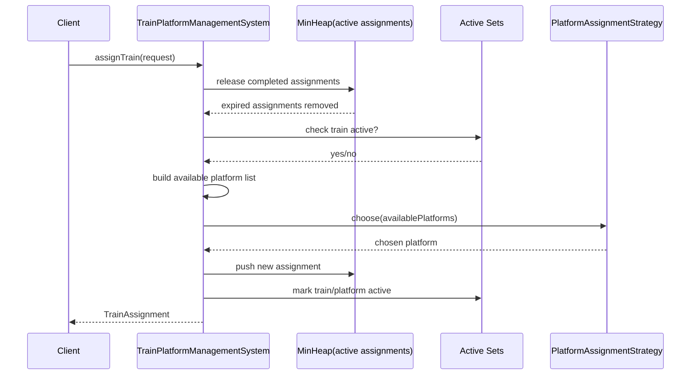
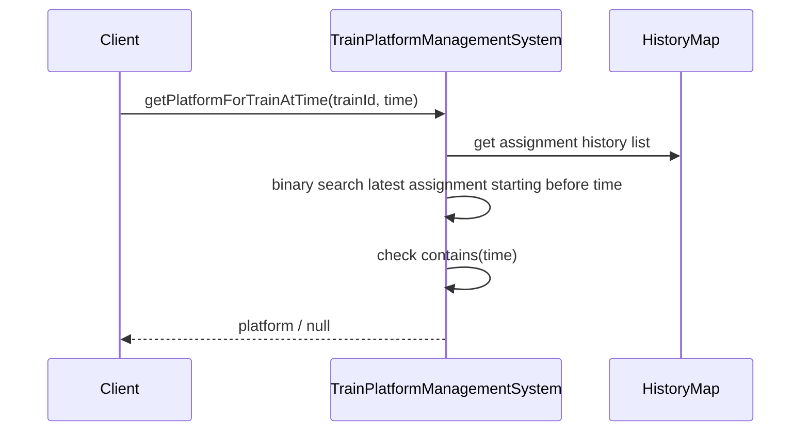

# Train Platform Management System Using Heap

## Problem
Design a Train-Platform Management System.

Requirements:
- assign trains to platforms
- query which train is at a given platform at a specific time
- query which platform a train is at, at a specific time
- write runnable Java code
- explain patterns and design choices

## Final chosen heap-based approach
This version uses a **min-heap strategy** for active scheduling.

Key assumption:
- booking requests come in **sorted by start time**

Because of that assumption:
- we can keep only currently active assignments in a min-heap ordered by `endTime`
- before processing next request, heap se sab completed assignments hata do
- freed platforms phir se available ho jate hain

## Why heap works here
If requests sorted by start time hain, then:
- next decision ke liye hume sirf currently active assignments matter karte hain
- jo assignment sabse pehle khatam hoga, woh heap top pe rahega

This makes assignment flow simple:
1. release completed assignments
2. find free platform
3. assign train
4. push active assignment into heap

## Important assumption
This design **depends on sorted incoming requests by start time**.

Comment also added in code:
- `TrainPlatformManagementSystem.assignTrain(...)`

If requests unsorted ho:
- heap-only approach enough nahi hota
- then `TreeMap` / interval-based calendar approach better hai

## Core classes
- `TimeSlot`
- `Train`
- `Platform`
- `TrainAssignment`
- `AssignmentRequest`
- `TrainPlatformManagementSystem`
- `PlatformAssignmentStrategy`
- `FirstAvailablePlatformStrategy`
- `RandomAvailablePlatformStrategy`

## What data structures are used

### 1. Min-Heap
- stores active assignments
- sorted by assignment end time
- used to release platforms/train occupancy quickly

### 2. Active sets
- `activeTrainIds`
- `occupiedPlatformIds`

These tell us current real-time occupancy.

### 3. History maps
- `trainHistoryByTrainId`
- `platformHistoryByPlatformId`

These support time-based queries later.

## Why history is still needed
Heap sirf current active assignments ke liye useful hai.

But queries like:
- `P1 pe 10:10 pe kaunsi train thi?`
- `T3 10:50 pe kis platform pe tha?`

Need historical assignments.

So:
- heap -> live scheduling
- history list -> point-in-time queries

Memory line:

`Heap current ke liye, history past lookup ke liye`

## Design patterns used

### 1. Strategy pattern
- `PlatformAssignmentStrategy`
- current implementations:
- `FirstAvailablePlatformStrategy`
- `RandomAvailablePlatformStrategy`

This makes room/platform selection extensible.

### 2. Facade / service style
- `TrainPlatformManagementSystem` is the entry point
- clients ko internal heap/history structure ka detail nahi pata

## Sequence diagram

## Query flow

## Important interview answers

### 1. Why heap?
Because requests sorted by start time hain.
Toh assignment release order naturally end time pe manage kar sakte hain.

### 2. Why active sets?
Heap se completed assignments release karte waqt:
- platform free karna hai
- train ko inactive mark karna hai

Sets make current availability checks simple.

### 3. Why keep both platform history and train history?
Because dono query types required hain:
- platform -> train
- train -> platform

### 4. Why binary search on history list?
Because requests sorted by start time hain, history append order sorted hi rahega.

### 5. What if requests are not sorted?
Then this heap approach weak ho jayega.
Tab TreeMap/range-query approach better hai.

## Code flow in simple Hinglish

`Nayi request aane se pehle heap se purani khatam assignments hata do.`

`Phir dekho kaunsi platforms free hain.`

`Strategy se ek choose karo.`

`Assignment banao, heap me daalo, history me store karo.`

## Files
- `TimeSlot.java`
- `Train.java`
- `Platform.java`
- `TrainAssignment.java`
- `AssignmentRequest.java`
- `TrainPlatformManagementSystem.java`
- `PlatformAssignmentStrategy.java`
- `FirstAvailablePlatformStrategy.java`
- `RandomAvailablePlatformStrategy.java`
- `Main.java`

## Extensibility ideas
- unsorted request support using `TreeMap`
- concurrency with locks
- platform type compatibility
- train priority
- maintenance windows
