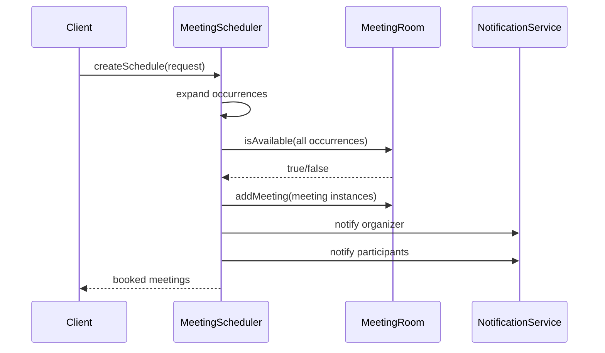

# Meeting Scheduler

This package contains a very simple meeting scheduler design that is easy to remember in interviews.

## Requirements Covered

- create meeting rooms
- accept meeting booking request
- support one-time and recurring schedules
- find any available room
- check time overlap
- assign room
- keep a logical schedule and actual meeting occurrences separately
- notify organizer and participants

## Classes

- `User`
  - meeting organizer or participant
- `TimeSlot`
  - start and end time
  - knows how to check overlap
- `MeetingRoom`
  - room details
  - keeps already booked meetings
- `MeetingRequest`
  - input object for both one-time and recurring schedule creation
- `Schedule`
  - logical booking entry
  - works like schedule table in DB
- `Meeting`
  - actual booked occurrence
  - works like meeting table in DB
- `NotificationService`
  - abstraction for sending notifications
- `ScheduleRepository`
  - in-memory schedule DB
- `MeetingRepository`
  - in-memory meeting DB
- `MeetingScheduler`
  - main orchestrator

## Easy Memory Trick

Remember it like this for one-time:

`Request -> find room -> create meeting -> save in room -> notify users`

For recurring:

`Request -> create schedule -> expand occurrences -> find one room -> save all meetings`

## Why this is easy to remember

- `TimeSlot` handles only time logic
- `MeetingRoom` handles only room availability
- `Schedule` is the parent object
- `Meeting` is one real occurrence
- `MeetingScheduler` handles schedule creation + room booking flow
- `NotificationService` handles only notifications

So each class has one job.

## Design Pattern Used

- Strategy pattern
  - `NotificationService` can have multiple implementations like email, SMS, push

## Sample Flow

## Interview Explanation in Hinglish

- `TimeSlot` overlap nikalta hai
- `MeetingRoom` batata hai room free hai ya nahi
- `Schedule` logical booking hai
- `Meeting` actual occurrence hai
- `MeetingScheduler` recurring ho to pehle occurrences expand karta hai, phir room assign karta hai
- `NotificationService` sabko inform kar deta hai

## Why This Is Better For LLD

- interviewer ko dikhta hai ki tum logical schedule aur real meetings ka difference samajhte ho
- in-memory repository se tum DB table ki thinking bhi show kar dete ho
- code still small and easy to explain

## Future Extensions

- attendee conflict checking
- priority room selection strategy
- thread-safe room booking
- schedule cancel / update
