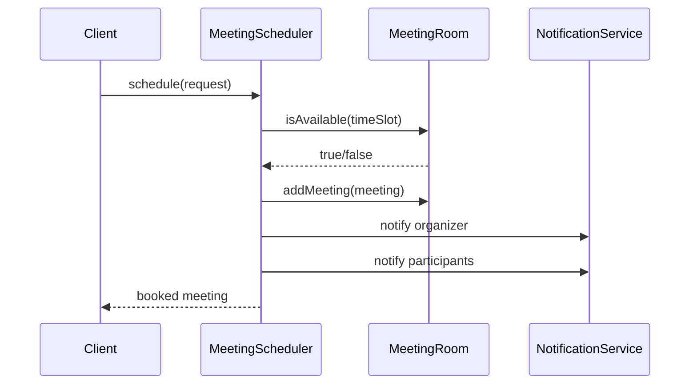

# Meeting Scheduler

This package contains a very simple meeting scheduler design that is easy to remember in interviews.

## Requirements Covered

- create meeting rooms
- accept meeting booking request
- find any available room
- check time overlap
- assign room
- notify organizer and participants

## Classes

- `User`
  - meeting organizer or participant
- `TimeSlot`
  - start and end time
  - knows how to check overlap
- `MeetingRoom`
  - room details
  - keeps already booked meetings
- `MeetingRequest`
  - input object used by scheduler
- `Meeting`
  - final booked meeting
- `NotificationService`
  - abstraction for sending notifications
- `MeetingScheduler`
  - main orchestrator

## Easy Memory Trick

Remember it like this:

`Request -> find room -> create meeting -> save in room -> notify users`

## Why this is easy to remember

- `TimeSlot` handles only time logic
- `MeetingRoom` handles only room availability
- `MeetingScheduler` handles only booking flow
- `NotificationService` handles only notifications

So each class has one job.

## Design Pattern Used

- Strategy pattern
  - `NotificationService` can have multiple implementations like email, SMS, push

## Sample Flow

## Interview Explanation in Hinglish

- `TimeSlot` overlap nikalta hai
- `MeetingRoom` batata hai room free hai ya nahi
- `MeetingScheduler` room dhoondh ke booking kar deta hai
- `NotificationService` sabko inform kar deta hai

## Future Extensions

- attendee conflict checking
- recurring meetings
- priority room selection strategy
- thread-safe room booking
