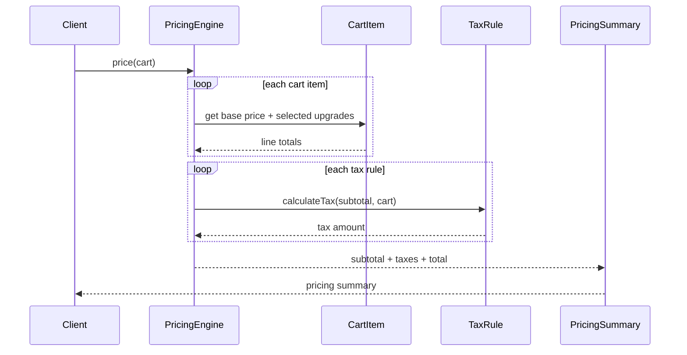

# Uber Eats Cart & Pricing Engine

## Problem
Design the core classes and interfaces for Uber Eats cart and pricing engine.

Must consider:
- base prices
- upgrades
- taxes

Need:
- fully working implementation
- clean OOD
- easy extension for follow-up questions

## Final chosen approach
Main design simple rakha hai:

- `MenuItem` stores base price and possible upgrades
- `CartItem` stores selected item + quantity + chosen upgrades
- `Cart` stores all line items
- `TaxRule` abstraction handles taxes
- `PricingEngine` computes subtotal, taxes, and final total

This version is easy to remember and interview-friendly.

## Why this design works
- base price item level pe naturally fit hota hai
- upgrades selected item ke saath attach hote hain
- taxes cart subtotal pe apply hote hain
- tax logic pluggable hai using interface

## Core classes
- `MenuItem`
- `UpgradeOption`
- `CartItem`
- `Cart`
- `TaxRule`
- `PercentageTaxRule`
- `PricingEngine`
- `PricingSummary`

## Sequence diagram

## Design patterns used

### 1. Strategy pattern
- `TaxRule` is strategy abstraction
- `PercentageTaxRule` is one implementation

If interviewer asks for more:
- item-category-specific tax
- state tax
- restaurant tax
- dynamic holiday tax

easy ho jayega.

### 2. Value object style
- `UpgradeOption`
- `LineItemPriceBreakdown`
- `TaxBreakdown`
- `PricingSummary`

These are simple immutable-ish data holders.

## Pricing flow

### Step 1: line item pricing
For each item:
- base price * quantity
- sum selected upgrade prices
- upgrade total * quantity
- line total = base total + upgrades total

### Step 2: subtotal
- add all line totals

### Step 3: taxes
- run all tax rules on subtotal

### Step 4: final total
- subtotal + all taxes

## Hinglish memory model

### Poora system yaad kaise rakho
- `MenuItem` = product definition
- `CartItem` = what customer selected
- `PricingEngine` = calculator
- `TaxRule` = tax strategy

Memory line:

`Line total nikalo -> subtotal banao -> tax lagao -> final total do`

## Important interview answers

### 1. Why put upgrades on `MenuItem`?
Kyuki har item ke valid upgrades alag ho sakte hain.
Burger pe cheese valid ho sakta hai, fries pe nahi.

### 2. Why validate selected upgrades in `CartItem`?
Taaki invalid upgrade combinations reject ho jayein early.

### 3. Why `TaxRule` interface?
Kyuki tax logic future me change hota hai.
Hardcode karoge to pricing engine messy ho jayega.

### 4. Why `BigDecimal`?
Pricing aur tax me floating-point rounding issues avoid karne ke liye.

### 5. Where would discounts fit?
Same style me:
- `DiscountRule` interface
- subtotal ya pre-tax phase me apply kara sakte ho

## Example
- Burger = `199`
- Extra Cheese = `30`
- Bacon = `50`
- quantity = `2`

Line total:
- base = `199 * 2 = 398`
- upgrades = `(30 + 50) * 2 = 160`
- line total = `558`

## Files
- `UpgradeOption.java`
- `MenuItem.java`
- `CartItem.java`
- `Cart.java`
- `TaxRule.java`
- `PercentageTaxRule.java`
- `LineItemPriceBreakdown.java`
- `TaxBreakdown.java`
- `PricingSummary.java`
- `PricingEngine.java`
- `Main.java`

## Extensibility ideas
- discounts / coupons
- delivery fee
- surge / small-cart fee
- item category taxes
- restaurant-specific pricing rules
