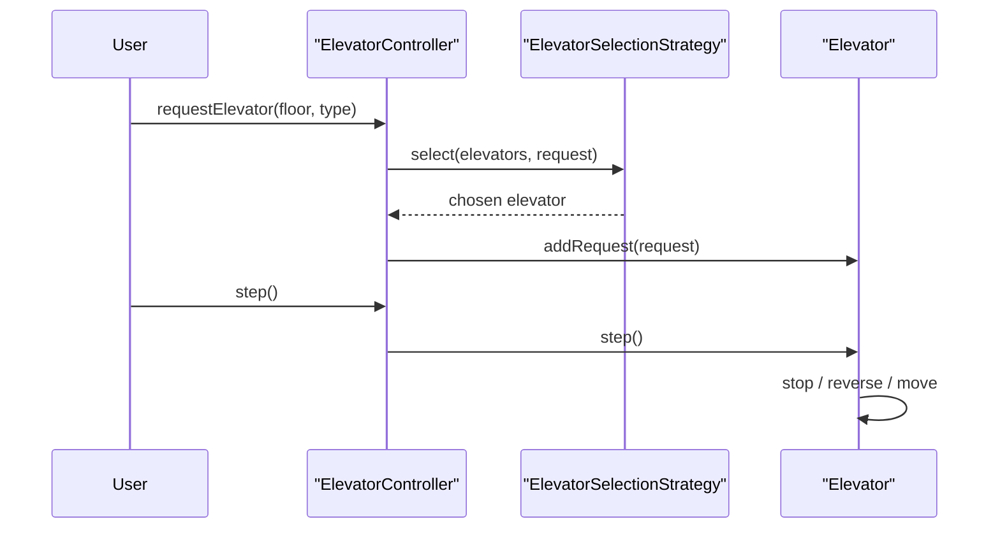

# Elevator LLD In 4 Phases

This folder is a phase-wise version of Elevator LLD so you can remember the problem step by step instead of trying to memorize the full solution at once.

Base folder:

- `/Users/sajalagrawal/Documents/LLD/src/main/java/elevator`

Phase folders:

- `/Users/sajalagrawal/Documents/LLD/src/main/java/elevator/phase1`
- `/Users/sajalagrawal/Documents/LLD/src/main/java/elevator/phase2`
- `/Users/sajalagrawal/Documents/LLD/src/main/java/elevator/phase3`
- `/Users/sajalagrawal/Documents/LLD/src/main/java/elevator/phase4`

## Problem Requirements

- system manages multiple elevators
- fixed floors, for example `0` to `9`
- hall calls from floor with direction:
  - `PICKUP_UP`
  - `PICKUP_DOWN`
- inside elevator destination requests:
  - `DESTINATION`
- simulation runs by discrete `step()` / tick
- invalid floors should be rejected
- elevator should keep moving in same direction and reverse only when needed

## How To Remember The Whole Problem

Remember the problem in this order:

1. one elevator ka movement sahi karo
2. multiple elevators add karo
3. controller se dispatch karao
4. selection logic ko strategy bana do
5. follow-up extensibility add karo

Simple memory line:

`Request lo -> elevator choose karo -> step pe move karao -> stop/reverse rules apply karo`

## Phase 1

Folder:

- `/Users/sajalagrawal/Documents/LLD/src/main/java/elevator/phase1`

### What it implements

- only one elevator
- basic request model
- `step()` based movement
- stop at requested floors
- reverse direction when no requests ahead

### Why this phase matters

If phase 1 samajh gaya, toh elevator ka core movement samajh gaya.

### Main classes

- `Elevator`
- `Request`
- `Direction`
- `RequestType`

### Intuition

Pehle single elevator ko sahi chalao.
Multi-elevator baad ka problem hai.

## Phase 2

Folder:

- `/Users/sajalagrawal/Documents/LLD/src/main/java/elevator/phase2`

### What it implements

- multiple elevators
- controller added
- hall call and destination request split
- nearest-elevator dispatch
- each elevator still owns its own movement

### Why this phase matters

Ab hum resource allocation add karte hain:

- kaunsi elevator ko request milegi?

### Main classes

- `ElevatorController`
- `Elevator`
- `Request`

### Intuition

`Controller choose karega, Elevator move karegi`

## Phase 3

Folder:

- `/Users/sajalagrawal/Documents/LLD/src/main/java/elevator/phase3`

### What it implements

- better dispatch logic
- strategy pattern for elevator selection
- meaningful helper methods
- direction-aware / request-aware selection
- cleaner abstraction for interview explanation

### Why this phase matters

Yahi final core LLD interview version hai.

Yahan tum bol sakte ho:

- movement logic elevator ke andar hai
- selection logic strategy ke andar hai
- controller sirf orchestration karta hai

### Main classes

- `ElevatorController`
- `Elevator`
- `ElevatorSelectionStrategy`
- `SmartNearestElevatorSelectionStrategy`
- `Request`

## Phase 4

Folder:

- `/Users/sajalagrawal/Documents/LLD/src/main/java/elevator/phase4`

### What it implements

- express elevator
- priority floors
- request cancellation
- simple thread safety
- extensibility-focused strategy

### Why this phase matters

Ye phase follow-up round ke liye hai.
Core solution ho chuki hoti hai, ab interviewer dekhna chahta hai design extend kaise hota hai.

### Main classes

- `ElevatorController`
- `Elevator`
- `ElevatorSelectionStrategy`
- `ExpressAwareElevatorSelectionStrategy`
- `Request`

### Intuition

`base movement same rakho, special behavior config aur strategy me add karo`

## Design Patterns Used

### Strategy Pattern

Phase 3 and phase 4 use strategy pattern in:

- `/Users/sajalagrawal/Documents/LLD/src/main/java/elevator/phase3/ElevatorSelectionStrategy.java`
- `/Users/sajalagrawal/Documents/LLD/src/main/java/elevator/phase4/ElevatorSelectionStrategy.java`

This helps when interviewer asks:

- nearest strategy
- direction-aware strategy
- priority/express strategy

## Important Helper Functions To Remember

These are the most interview-friendly functions:

- `chooseInitialDirection()`
- `findNearestRequest()`
- `shouldStopAtCurrentFloor()`
- `removeServedRequestsAtCurrentFloor()` / `clearServedRequestsAtCurrentFloor()`
- `hasAnyRequestAhead()`
- `hasRequestsAtOrBeyond()`
- `select(...)` in selection strategy

These helper methods make the code easy to speak out loud.

## Recommended Study Order

Read in this order:

1. `/Users/sajalagrawal/Documents/LLD/src/main/java/elevator/phase1/Elevator.java`
2. `/Users/sajalagrawal/Documents/LLD/src/main/java/elevator/phase2/ElevatorController.java`
3. `/Users/sajalagrawal/Documents/LLD/src/main/java/elevator/phase3/SmartNearestElevatorSelectionStrategy.java`
4. `/Users/sajalagrawal/Documents/LLD/src/main/java/elevator/phase3/Elevator.java`
5. `/Users/sajalagrawal/Documents/LLD/src/main/java/elevator/phase3/ElevatorController.java`
6. `/Users/sajalagrawal/Documents/LLD/src/main/java/elevator/phase4/ExpressAwareElevatorSelectionStrategy.java`
7. `/Users/sajalagrawal/Documents/LLD/src/main/java/elevator/phase4/ElevatorController.java`

## Interview Flow You Can Speak

You can explain like this:

1. I will start with one elevator and model movement using discrete ticks.
2. Then I will add a controller that owns multiple elevators.
3. Hall calls go to controller, destination requests go to a chosen elevator.
4. Elevator continues in same direction, stops when needed, reverses when no requests are ahead.
5. Then I will move elevator selection logic into a strategy to keep controller clean.
6. Finally, I will show how to extend the design for express elevators, cancellation, and concurrency.

## Sequence Diagram

## Final Hinglish Summary

- phase 1: `lift ko chalao`
- phase 2: `controller se lift choose karao`
- phase 3: `selection logic ko clean aur extensible banao`
- phase 4: `follow-up twists ko existing design me fit karo`

That is the full intuition ladder for this problem.
