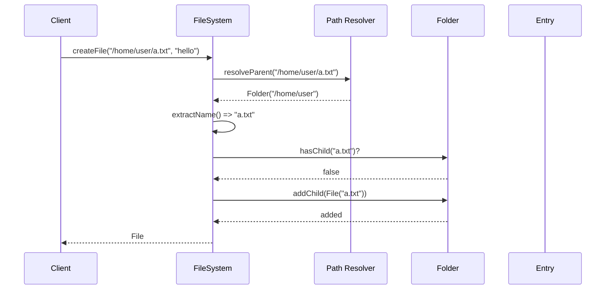
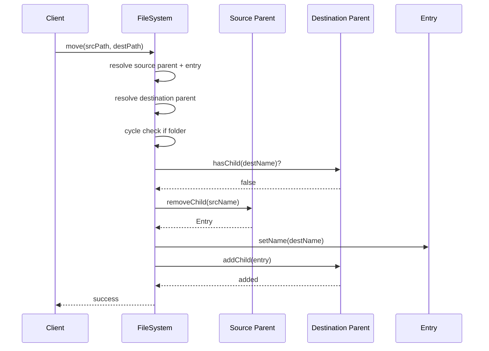

# In-Memory File System

## Final chosen approach
Final interview-friendly approach ye hai:

- `FileSystem` = orchestrator / public API
- `FileSystemNode` = shared abstraction
- `File` = leaf node with string content
- `Folder` = container node with `Map<name, child>`
- parent pointers use karenge, full path store nahi karenge

Ye approach best hai because:
- code easy to remember hai
- rename / move simple rehte hain
- path dynamically compute hota hai
- lookup fast rehta hai because folder children map mein stored hain

## Problem
Unix-style in-memory file system design karna hai.

Support:
- single root `/`
- files with string content
- folders with child files/folders
- create
- delete
- get by path
- list folder contents
- rename
- move
- full path retrieval from any entry

## Out of scope
- search
- relative paths like `../` or `./`
- permissions / ownership / timestamps
- symbolic links
- persistence

## Interview goal
Interviewer usually dekhna chahega:
- tree structure kaise model karte ho
- path resolution kaise karte ho
- rename/move mein path consistency kaise maintain hoti hai
- cycle detection kaise karte ho
- file aur folder ke shared abstraction ko kaise identify karte ho

## Final requirements covered in this code
- hierarchical file system with single root
- files store string content
- folders contain other entries
- create/delete file and folder
- list folder contents
- absolute path resolution
- move and rename
- full path from any node
- tens of thousands scale ke liye folder children map-based lookup

## Core classes
- `FileSystem`
- `FileSystemNode`
- `File`
- `Folder`
- `AlreadyExistsException`
- `InvalidPathException`
- `NotFoundException`
- `NotADirectoryException`

## Hinglish memory model

### Poora system ka shortcut
- `FileSystem` = navigator + public API
- `Folder` = map of children
- `File` = content holder
- `parent` pointer = reverse navigation

Memory line:

`Path ko resolve karo -> parent tak jao -> map update karo`

## Why parent pointer and not stored full path?
Do options the:

### Option 1: full path store karo
Problem:
- rename/move ke time poore subtree ke paths update karne padenge

### Option 2: parent pointer rakho
Benefit:
- rename/move mein sirf local pointers update hote hain
- `getPath()` dynamically calculate ho jata hai

Memory line:

`Path store mat karo, tree relation store karo`

## Why `Map<String, FileSystemNode>` inside folder?
Kyuki hume chahiye:
- fast child lookup
- collision detection
- add/remove by name

If list use karte:
- every lookup O(n)

Map use karte:
- lookup expected O(1)

## Main design decision
Public methods sab `FileSystem` pe hain.
Isse:
- path parsing ek jagah rehti hai
- caller ko tree internals nahi pata hone chahiye
- API clean rehti hai

## Public APIs
- `createFile(path, content)`
- `createFolder(path)`
- `get(path)`
- `list(path)`
- `delete(path)`
- `rename(path, newName)`
- `move(srcPath, destPath)`

## Core flows

### Create file
1. path validate karo
2. parent resolve karo
3. last component as name nikalo
4. collision check karo
5. file add karo

### Create folder
1. path validate karo
2. parent resolve karo
3. name nikalo
4. collision check karo
5. folder add karo

### Delete
1. root delete allowed nahi
2. parent resolve karo
3. child remove karo

### Rename
1. root rename allowed nahi
2. parent resolve karo
3. old name remove karo
4. new name set karo
5. map me re-add karo

### Move
1. source entry resolve karo
2. destination parent resolve karo
3. collision check karo
4. cycle check karo if source is folder
5. source parent se remove
6. new parent me add

## Why move is tricky
Sabse important edge case:

`/home` ko `/home/user/stuff` ke andar move nahi kar sakte

Kyun?
- tree cycle ban jayega

Memory line:

`Folder ko apne hi descendant ke andar move nahi kar sakte`

## Sequence diagram

## Move flow

## Important interview comments / answers

### 1. `FileSystemNode` abstraction kyu?
Kyuki file aur folder dono share karte hain:
- name
- parent
- path calculation

### 2. `rename()` mein remove + add kyu?
Kyuki folder children map name-keyed hota hai.
Sirf `setName()` kar diya to parent map stale ho jayega.

### 3. `list()` sort kyu kar raha hai?
Deterministic output milta hai.
Interview / testing dono mein easier hota hai.

### 4. root pe create/delete/move/rename kyu restrict kiya?
Root special node hai.
Usko delete ya move karoge to poora system invalid ho jayega.

### 5. Path validation alag helper mein kyu?
Kyuki ye logic multiple methods mein repeat hota hai.
Centralized validation easier to reason about hoti hai.

### 6. Trailing slash reject kyu?
`/a/b/` jaise path create operations mein empty name create kar sakte the.
Explicit validation better hai.

## Code flow summary in simple Hinglish

`FileSystem path ko todta hai.`

`Folder child map se lookup karta hai.`

`Parent pointer reverse direction maintain karta hai.`

`Move/rename map update aur parent consistency maintain karke hota hai.`

## Files
- `FileSystem.java`
- `FileSystemNode.java`
- `Folder.java`
- `File.java`
- `FileSystemMain.java`
- exception classes

## Extensibility
See:
- `extensibility/README.md`
