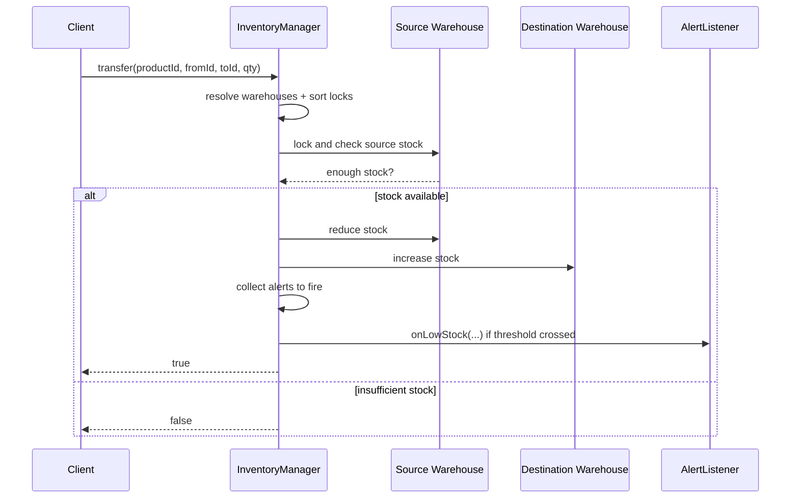

# Inventory Management LLD - Memory Guide

## 1) Core Objects
- `InventoryManager`: public API + cross-warehouse coordination
- `Warehouse`: inventory map + alert configs + stock rules
- `AlertConfig`: threshold + listener pair
- `AlertListener`: pluggable callback

## 2) Main Flow
Add stock:
1. Find warehouse
2. Increase quantity
3. Collect threshold-crossing alerts
4. Fire alerts outside lock

Remove stock:
1. Find warehouse
2. Validate enough stock
3. Decrease quantity
4. Collect threshold-crossing alerts
5. Fire alerts outside lock

Transfer:
1. Find both warehouses
2. Lock both in sorted order
3. Validate source has enough stock
4. Decrease source, increase destination
5. Fire any alerts after releasing locks

## 3) Key Rules
- Stock can never go negative
- Alerts are per product per warehouse
- Alert fires only when stock crosses threshold downward
- Operations are thread-safe

## 4) Minimal API
- `addStock(warehouseId, productId, quantity)`
- `removeStock(warehouseId, productId, quantity)`
- `transfer(productId, fromWarehouseId, toWarehouseId, quantity)`
- `getWarehousesWithAvailability(productId, quantity)`
- `setLowStockAlert(warehouseId, productId, threshold, listener)`

## 5) Sequence Diagram

