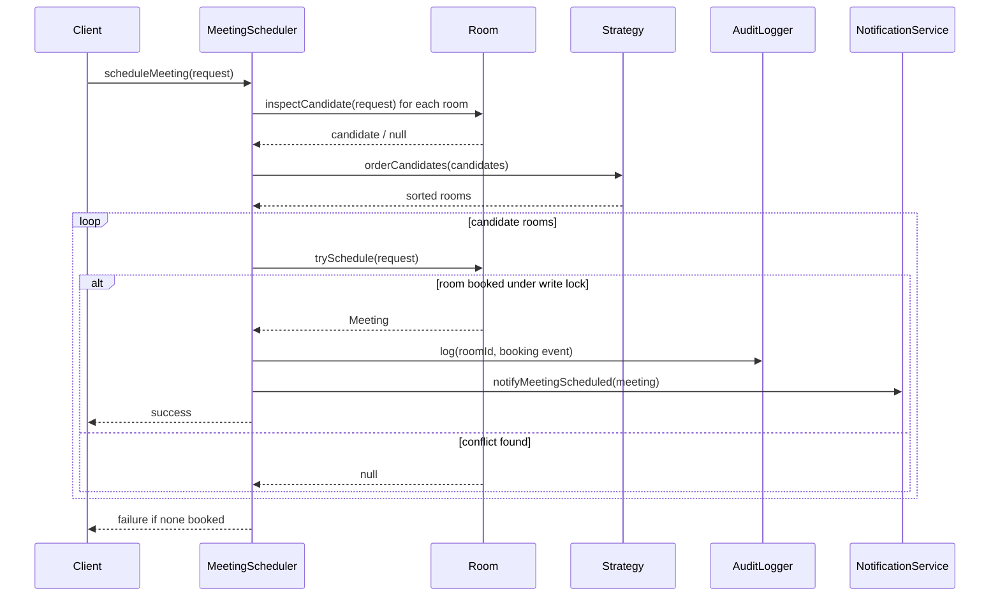
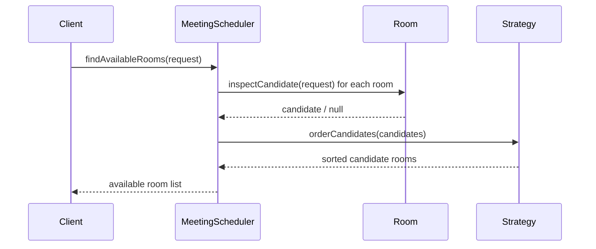
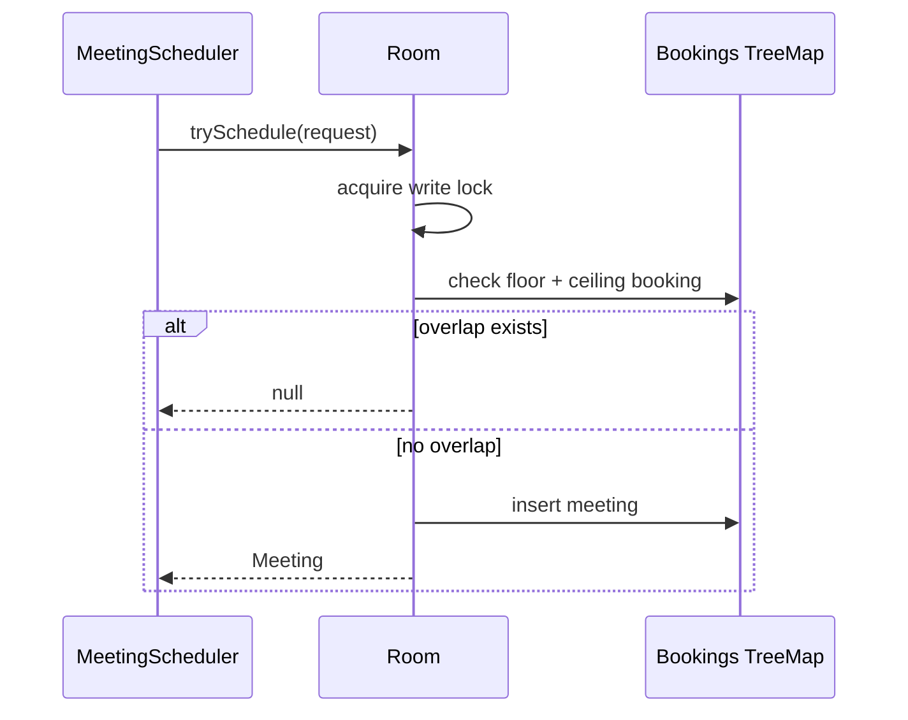

# Meeting Room Scheduler

## Final chosen approach
Bahut saare versions dekhne ke baad, final interview-friendly approach ye choose kiya hai:

- `Room` apna khud ka calendar maintain karega
- `MeetingScheduler` orchestration karega
- room selection strategy alag interface se hogi
- notifications alag component handle karega
- audit logging alag component handle karega
- final booking room ke write lock ke andar hogi

Ye approach best hai because:
- yaad rakhna easy hai
- requirements cover ho jati hain
- concurrency bug avoid hota hai
- future mein strategy / filters / persistence add karna easy rehta hai

## Problem
Meeting rooms diye hue hain.
Request aati hai:
- `startTime`
- `endTime`
- `requiredCapacity`

Room assign karna hai only if:
- room free ho
- room capacity enough ho
- best room choose karo using **minimum spillage**

Extra:
- concurrency handle karni hai
- audit logs store karne hain
- old audit logs delete karne hain

Also support:
- available rooms query for a given request
- notifications to invited participants
- room calendar based availability tracking

## Interview goal
Is problem mein interviewer usually dekhna chahega:
- room availability kaise check karte ho
- overlapping meetings kaise avoid karte ho
- best-fit / min-spillage selection kaise karte ho
- concurrency mein double booking kaise rokoge

## Final requirements covered in this code
- N rooms available
- book a room using:
- start time
- end time
- required capacity
- find available rooms
- track bookings through room calendar
- notify invited participants after successful booking
- support minimum-spillage room selection
- store audit logs per room
- purge audit logs after retention period
- handle concurrent booking requests safely

## Core classes
- `TimeInterval`
- `MeetingRequest`
- `Meeting`
- `Room`
- `RoomCandidate`
- `AvailableRoomView`
- `RoomSelectionStrategy`
- `MinSpillageRoomSelectionStrategy`
- `MeetingScheduler`
- `NotificationService`
- `AuditLogger`

## Hinglish memory model

### Poora system ka shortcut
- `Room` = actual calendar + lock
- `MeetingScheduler` = orchestrator
- `Strategy` = kaunsa room choose karna hai
- `AuditLogger` = history

Memory line:

`Find candidates -> sort by strategy -> try atomic booking -> log + notify`

## Why this final version is the best balance

### Version 1: very simple room scheduler
Pros:
- fast to code
- easy to explain

Cons:
- race condition in `isAvailable()` then `book()`
- no strategy abstraction
- weak extensibility

### Version 2: user calendar scheduler
Pros:
- good for invite + recurrence discussion

Cons:
- room scheduling problem directly solve nahi karta

### Final chosen version
Pros:
- room problem directly solve karta hai
- simple enough to remember
- concurrency-safe
- strategy based
- notifications + audit logging included

Memory line:

`Simple room model + safe booking + optional strategy`

## Main design decision
Availability check aur actual booking alag phases mein hoti hai:

1. **Read phase**
- candidate rooms identify karo
- spillage calculate karo

2. **Write phase**
- sorted candidates pe ek ek karke actual booking try karo
- `Room.trySchedule()` ke andar final overlap check hota hai under write lock

Ye important hai because:
- read phase ke baad bhi race ho sakta hai
- isliye final truth room ke write lock ke andar decide hota hai

## Why the naive approach breaks
Naive code:

```java
if (room.isAvailable(slot)) {
    room.book(slot);
}
```

Problem:
- do threads same time pe availability dekh sakte hain
- dono ko room free dikhega
- dono booking kar denge

Hinglish memory:

`Check-then-act alag hua to race pakki hai`

## Why this design is safe
- `Room.inspectCandidate()` read lock use karta hai for snapshot-style inspection
- `Room.trySchedule()` write lock use karta hai
- `trySchedule()` ke andar **phir se** availability check hota hai

Memory line:

`Final booking decision hamesha write lock ke andar lo`

## Public APIs in this design

### 1. `findAvailableRooms(request)`
- capacity + availability + spillage ke basis pe sorted rooms return karta hai

### 2. `scheduleMeeting(request)`
- best room pick karta hai
- actual booking try karta hai
- success pe log + notify karta hai

### 3. `purgeAuditLogs(retention)`
- old room logs cleanup karta hai

## Minimum spillage ko simple mein kaise yaad rakho
Spillage matlab:
- room ke surrounding free slot mein se request fit karne ke baad kitna extra free gap bachta hai

Simple memory:

`Jo room request ko sabse tight fit kare, wahi choose karo`

Example:
- Room A free gap = 3 hours
- Room B free gap = 1 hour 10 min
- request = 1 hour

Toh Room B better hai because wasted free time kam hai.

## Strategy pattern kaha use hua?
- `RoomSelectionStrategy` abstraction hai
- `MinSpillageRoomSelectionStrategy` current implementation hai

Later add kar sakte ho:
- best fit capacity
- round robin
- least utilized

## Sequence diagram



## Available rooms flow



## Room booking flow



## Important interview comments / answers

### 1. TreeMap kyu?
Kyuki bookings sorted chahiye by start time.
Then:
- floor booking dekh sakte ho
- ceiling booking dekh sakte ho
- overlap fast check hota hai

### 2. Room ke andar lock kyu?
Kyuki room ka schedule mutable shared state hai.
Same room pe do concurrent requests aa sakti hain.

### 3. Global scheduler pe ek bada lock kyu nahi?
Kyunki phir saari bookings serial ho jayengi.
Per-room locking better concurrency deta hai.

### 4. Final overlap check dobara kyu?
Kyuki candidate discovery ke baad state change ho sakti hai.

### 5. Audit logs alag component mein kyu?
Kyuki booking logic aur audit retention ka concern alag hai.
Single Responsibility clean rehta hai.

### 6. Notifications booking ke baad hi kyu?
Kyuki room successfully assign hone ke baad hi attendees ko batana chahiye.
Fail hui booking pe notification nahi bhejni chahiye.

### 7. Available rooms API kaise kaam karega?
Same candidate discovery logic use karega, bas booking nahi karega.

## Code flow summary in simple Hinglish

`Scheduler pehle rooms ko puchta hai ki tum candidate ho ya nahi.`

`Phir strategy decide karti hai kis order mein try karna hai.`

`Phir scheduler actual booking try karta hai room ke write lock ke andar.`

`Jo pehla room safely book ho jaye, usi ko assign kar dete hain.`

`Agar sirf list chahiye ho, to same candidates ko sorted karke return kar do.`

## Files
- `TimeInterval.java`
- `MeetingRequest.java`
- `Meeting.java`
- `Room.java`
- `RoomCandidate.java`
- `AvailableRoomView.java`
- `RoomSelectionStrategy.java`
- `MinSpillageRoomSelectionStrategy.java`
- `MeetingScheduler.java`
- `AuditLogEntry.java`
- `AuditLogger.java`
- `InMemoryAuditLogger.java`
- `NotificationService.java`
- `ConsoleNotificationService.java`
- `Main.java`

## Extensibility
See:
- `extensibility/README.md`
