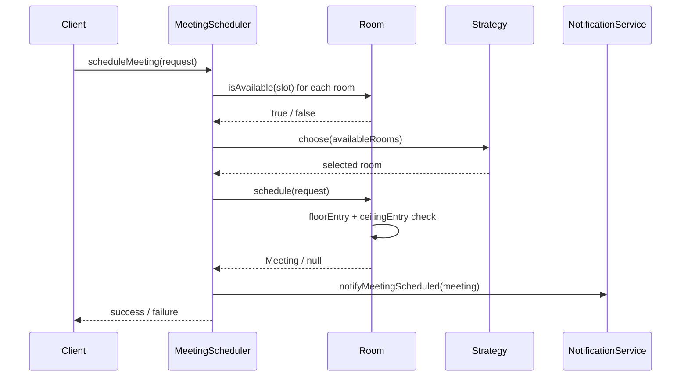
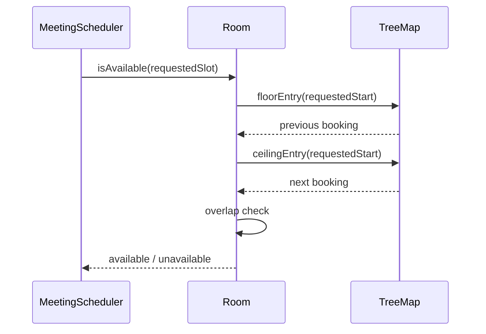

# Meeting Room Scheduler Using `TreeMap`

Meeting Scheduler

LocalTimeZone vs Instant and how to convert LocalTimeZone to instant (in LLD meetingroomusinginstant)

if(meetingStart1!=null ){
Meeting meetingEnd1 = meetingTreeMap.get(meetingStart1);
if(!meetingEnd1.getTimeSlot().getEnd().isBefore(meetingRequest.timeSlot.getStart())){
return false;
}
}

LocalDateTime meetingStart2 = meetingTreeMap.ceilingKey(meetingRequest.timeSlot.getStart());
if(meetingStart2!=null ){
if(meetingStart2.isBefore(meetingRequest.timeSlot.getEnd())){
return false;
}
}

Yes — now the logic is correct, if your interval rule is half-open:

[start, end)

That means:
* meeting occupying 10:00 to 11:00
* another meeting starting exactly at 11:00
* is allowed
  So your code is correct for that interpretation.

## Problem
Design a meeting scheduler.

Requirements:
- there are `n` meeting rooms
- booking requests keep coming with:
- `start time`
- `end time`
- allocate **any available room**
- if meeting gets booked, send notification
- room calendar should track booked intervals

## Final chosen approach
This version is intentionally simple and interview-friendly:

- `Room` owns its own calendar
- room calendar is implemented using `TreeMap<startTime, Meeting>`
- `MeetingScheduler` is the orchestrator
- `RoomSelectionStrategy` decides which room to pick from available rooms
- `NotificationService` handles notifications

## Why `TreeMap`?
Because bookings are sorted by `startTime`.

That gives us efficient range-style neighbor lookup:
- `floorEntry(startTime)` -> closest booking before requested slot
- `ceilingEntry(startTime)` -> closest booking at/after requested slot

So for availability check, hume saare bookings scan nahi karne padte.

## Core classes
- `TimeSlot`
- `MeetingRequest`
- `Meeting`
- `Room`
- `MeetingScheduler`
- `RoomSelectionStrategy`
- `FirstAvailableRoomSelectionStrategy`
- `NotificationService`

## Interview memory model in Hinglish

### Poora system yaad kaise rakho
- `Room` = sorted calendar
- `MeetingScheduler` = request coordinator
- `Strategy` = kaunsa room choose karna hai
- `NotificationService` = post-booking action

Memory line:

`Find available room -> book inside room calendar -> notify`

## Why this design is easy to remember
Isme unnecessary complexity nahi hai:
- no audit logs
- no spillage logic
- no participant availability
- no recurrence

Bas room booking problem solve kar raha hai using clean OOD.

## Availability logic
For a requested slot:
- find previous booking using `floorEntry`
- find next booking using `ceilingEntry`
- if requested slot overlaps either, room unavailable

That is enough because all bookings are sorted by start time.

## Sequence diagram

## `TreeMap` flow inside room

## Important interview answers

### 1. Why `TreeMap` and not `List`?
`List` use karoge to every availability check may become full scan.

`TreeMap` use karke:
- sorted bookings milte hain
- nearby conflicts quickly check kar sakte ho

### 2. Why only floor and ceiling entries are enough?
Because bookings start-time-sorted hain.
Potential overlap closest previous ya closest next booking se hi aayega.

### 3. Why strategy pattern if only “any room” is needed?
Abhi `FirstAvailableRoomSelectionStrategy` use kiya hai.
But interview mein bol sakte ho:
- later best fit
- round robin
- least utilized
easy ho jayega.

### 4. Why does `Room` own the calendar?
Encapsulation.
Room khud decide karega:
- available hai ya nahi
- booking insert ho sakti hai ya nahi

### 5. Any gap in this version?
Yes:
- concurrency not handled
- if two threads same room ko same time pe try karein, race possible hai

This is okay for base round-2 LLD unless interviewer asks concurrency follow-up.

## Minimal API
- `findAvailableRooms(TimeSlot)`
- `scheduleMeeting(MeetingRequest)`

## Code flow in simple Hinglish

`Scheduler saare rooms ko puchta hai tum free ho kya.`

`Room apne TreeMap calendar me previous aur next booking dekh ke jawab deta hai.`

`Scheduler strategy se ek room choose karta hai.`

`Then room booking hoti hai aur notification chali jati hai.`

## Files
- `BookingStatus.java`
- `TimeSlot.java`
- `MeetingRequest.java`
- `Meeting.java`
- `Room.java`
- `MeetingScheduler.java`
- `RoomSelectionStrategy.java`
- `FirstAvailableRoomSelectionStrategy.java`
- `NotificationService.java`
- `ConsoleNotificationService.java`
- `Main.java`

## Extensibility
See:
- `extensibility/README.md`
