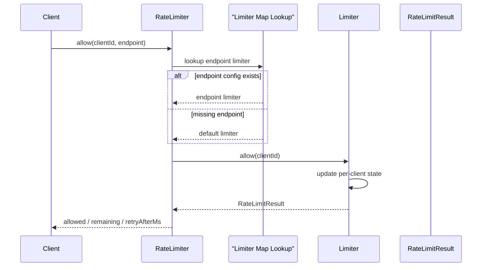
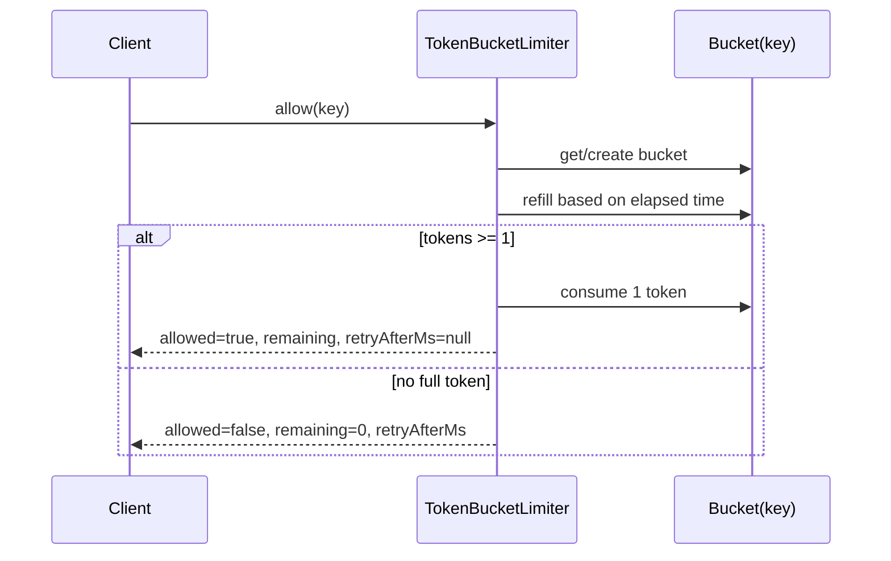
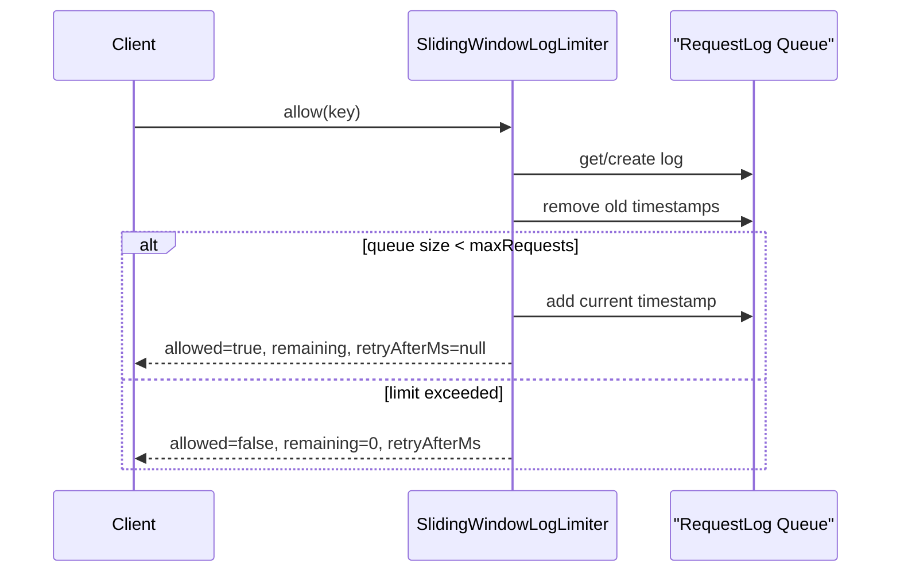
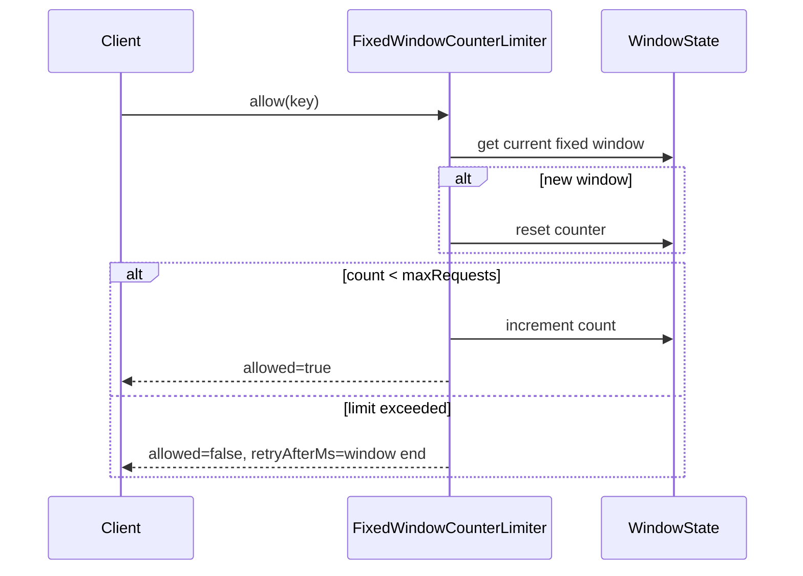
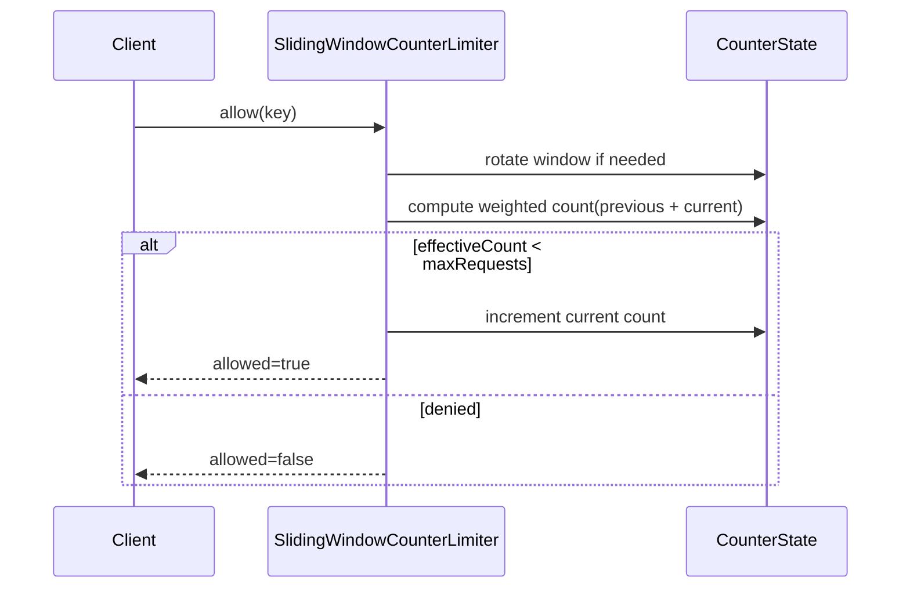
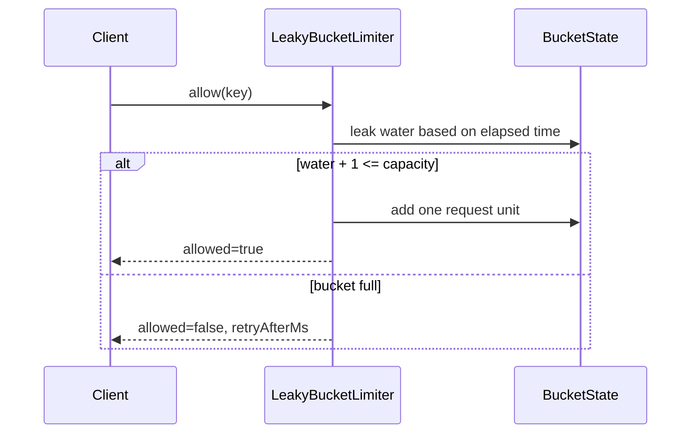

# Rate Limiter

## Problem
In-memory API gateway rate limiter build karna hai.

Input:
- `clientId`
- `endpoint`

Per endpoint config hota hai:
- algorithm
- algorithm-specific config

Output:
- `allowed`
- `remaining`
- `retryAfterMs`

## Interview goal
Is problem mein interviewer mainly dekhna chahta hai:
- tum entities kaise identify karte ho
- algorithm ko clean abstraction ke through kaise plug karte ho
- unknown endpoint pe default config kaise use karte ho
- result ko structured object mein kaise return karte ho

## Final requirements
- startup pe config load hoga
- request aayegi with `clientId` and `endpoint`
- endpoint-specific algorithm use hoga
- missing endpoint -> default limiter
- structured response dena hai
- in-memory single process scope

## Core classes
- `RateLimiter`
- `Limiter` interface
- `LimiterFactory`
- `RateLimitResult`
- `TokenBucketLimiter`
- `SlidingWindowLogLimiter`
- `FixedWindowCounterLimiter`
- `SlidingWindowCounterLimiter`
- `LeakyBucketLimiter`

## Simple mental model in Hinglish

### Poora system yaad kaise rakhna hai
- `RateLimiter` = traffic police / entry gate
- `LimiterFactory` = kaunsa algorithm banana hai, ye decide karta hai
- `Limiter` = actual checking logic
- `RateLimitResult` = final jawab

Memory line:

`Gate -> choose strategy -> check quota -> return result`

## Strategy pattern kaha use hua?
- `Limiter` interface strategy hai
- `TokenBucketLimiter` aur `SlidingWindowLogLimiter` uske concrete strategies hain
- `RateLimiter` ko algorithm details nahi pata, bas `allow()` call karta hai

Memory line:

`RateLimiter algorithm nahi jaanta, bas limiter.allow(key) call karta hai`

## Factory pattern kaha use hua?
- config runtime pe aata hai
- us config se correct limiter object banana hai
- isliye `LimiterFactory`

Memory line:

`Config dekho -> object banao`

## Algorithms yaad kaise rakhein

### 1. Token Bucket
Socho har client ke paas ek bucket hai.
- bucket mein max `capacity` tokens aa sakte hain
- time ke saath tokens refill hote hain
- har request 1 token kha leti hai
- token hai -> allow
- token nahi hai -> deny

Hinglish memory:

`Bucket bhar raha hai dheere dheere, request aake 1 token nikaal leti hai`

Kab use hota hai:
- burst allow karna ho
- average rate control karna ho

Yaad rakhne ka shortcut:
- bursty traffic friendly
- state per key:
- `tokens`
- `lastRefillTime`

### 2. Sliding Window Log
Socho har client ke liye last requests ka timestamp queue mein rakha hai.
- nayi request aayi
- purane timestamps hata do jo window ke bahar hain
- queue size check karo
- limit ke neeche ho -> allow
- warna deny

Hinglish memory:

`Pichhle window ke exact request timestamps sambhal ke rakho`

Kab use hota hai:
- accurate count chahiye ho
- memory zyada chal jaaye to bhi chalega

Yaad rakhne ka shortcut:
- accurate but memory heavy
- state per key:
- `Queue<timestamp>`

### 3. Fixed Window Counter
Socho time ko equal windows mein tod diya:
- 12:00 to 12:01
- 12:01 to 12:02

Har window mein sirf count rakho.
- request current window mein aayi
- count check karo
- limit cross hui to deny
- next window start होते hi counter reset

Hinglish memory:

`Time ko boxes mein baant do, har box ka counter rakho`

Kab use hota hai:
- simple implementation chahiye
- memory low rakhni ho

Catch:
- boundary issue hota hai
- ek request 12:00:59 pe aur ek 12:01:01 pe aa ke practical burst create kar sakti hai

### 4. Sliding Window Counter
Ye fixed window ka smarter version hai.
- current window ka count rakhta hai
- previous window ka count bhi rakhta hai
- dono ko weight deke approximate sliding result nikalta hai

Hinglish memory:

`Current box + previous box ko mix karke smarter estimate`

Kab use hota hai:
- sliding behavior chahiye
- but full log nahi store karna

Tradeoff:
- exact nahi hota
- but memory kaafi better hoti hai than sliding log

### 5. Leaky Bucket
Socho bucket mein paani bhar raha hai:
- request aayi -> paani badh gaya
- time ke saath bucket fixed rate se leak hoti hai
- bucket full ho gayi -> deny

Hinglish memory:

`Bucket se paani constant rate pe bahar nikal raha hai`

Kab use hota hai:
- output/request processing ko smooth karna ho
- burst ko flatten karna ho

Yaad rakhne ka shortcut:
- token bucket allows bursts
- leaky bucket smooths bursts

## Easy comparison table

| Algorithm | Sochne ka tareeka | Pros | Cons |
|---|---|---|---|
| Token Bucket | token jama hote rehte hain | bursts allow karta hai | refill math dhyaan se karna padta hai |
| Sliding Window Log | exact timestamps store karo | perfect accuracy | memory heavy |
| Fixed Window Counter | har fixed window ka counter | simplest and cheap | boundary burst issue |
| Sliding Window Counter | current + previous window weighted | good balance | approximate result |
| Leaky Bucket | bucket ka water level leak hota rehta hai | smooth traffic output | burst handling token bucket se different |

## Important interview comments / answers

### 1. `lastRefillTime` kyu chahiye?
Kyuki hum background thread se refill nahi kar rahe.
Request aane par hi refill calculate karte hain.

Memory line:

`On-demand refill ke liye last refill time chahiye`

### 2. `double tokens` kyu?
Kyuki refill continuous hota hai.
Example:
- refill rate = 10/sec
- 350ms mein 3.5 tokens refill honge

### 3. `1 - bucket.tokens` kyu karte hain retry calculation mein?
Kyuki bucket mein already fractional tokens ho sakte hain.
Example:
- current tokens = `0.7`
- full request ke liye `1.0` chahiye
- to sirf `0.3` aur wait karna hai

### 4. Limiter ke andar `Map<key, state>` kyu?
Kyuki state algorithm-specific hoti hai.
Token bucket ko `tokens + lastRefillTime` chahiye.
Sliding window ko `Queue<timestamp>` chahiye.
Centralize karoge to ugly `Object`-style design ho jayega.

### 5. Unknown endpoint pe reject kyu nahi?
Requirement hai default limiter use karna.
Practical bhi hai — missing config ki wajah se open traffic ya full reject dono avoid hote hain.

### 6. Fixed Window aur Sliding Window Counter mein difference?
- Fixed Window:
- current box ka count only
- Sliding Window Counter:
- current + previous box ka weighted estimate

Memory line:

`Fixed = ek box`

`Sliding Counter = do box ka smart average`

### 7. Token Bucket aur Leaky Bucket mein difference?
- Token Bucket:
- tokens save hote rehte hain
- burst allow karta hai
- Leaky Bucket:
- constant drain hota hai
- traffic smooth karta hai

Memory line:

`Token Bucket = save and spend`

`Leaky Bucket = fill and drain`

## Code flow

## Token Bucket flow

## Sliding Window Log flow

## Fixed Window Counter flow

## Sliding Window Counter flow

## Leaky Bucket flow

## What to say in interview in simple Hinglish

### High-level explanation
`Main RateLimiter request leta hai, endpoint ke basis pe correct limiter choose karta hai, aur fir per-client state use karke allow/deny result return karta hai.`

### Token Bucket one-liner
`Har client ke paas ek bucket hai jo time ke saath refill hoti hai, aur har request 1 token consume karti hai.`

### Sliding Window one-liner
`Har client ke recent request timestamps store karte hain, aur current rolling window ke andar kitni requests hui hain woh count karte hain.`

### Fixed Window one-liner
`Har fixed time window ka ek counter hota hai, window change होते hi reset ho jata hai.`

### Sliding Window Counter one-liner
`Current aur previous window ke counters ko weight dekar sliding approximation nikala jata hai.`

### Leaky Bucket one-liner
`Requests bucket ko bharte hain aur bucket fixed rate se leak hoti rehti hai, isliye output smooth hota hai.`

## Thread safety
Current implementation single-threaded interview scope ke liye hai.

If interviewer asks:
- use `ConcurrentHashMap`
- per-key locking
- global lock nahi, warna saare clients ek dusre ko block karenge

## Files
- `RateLimiter.java`
- `Limiter.java`
- `LimiterFactory.java`
- `LimiterConfig.java`
- `AlgorithmType.java`
- `RateLimitResult.java`
- `TokenBucketLimiter.java`
- `SlidingWindowLogLimiter.java`
- `FixedWindowCounterLimiter.java`
- `SlidingWindowCounterLimiter.java`
- `LeakyBucketLimiter.java`
- `Main.java`

## Extensibility
See:
- `extensibility/README.md`
