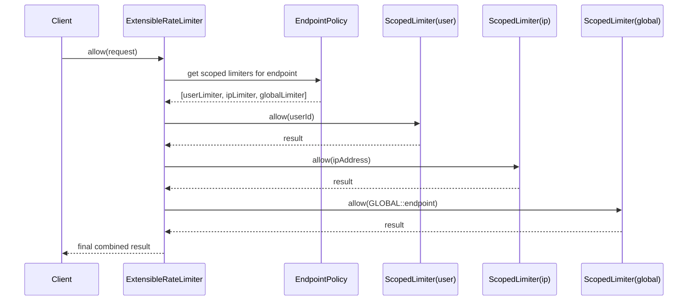

# Rate Limiter Extensibility

## Problem in real world
Ek endpoint pe sirf ek hi limit nahi hoti.

Same endpoint pe parallel limits ho sakti hain:
- user based limit
- api key based limit
- IP based limit
- global endpoint limit

Example:
- `/search`
- userId -> Sliding Window Log
- ipAddress -> Token Bucket
- global endpoint -> Token Bucket

Aur request tabhi allow hogi jab **saare applicable limits pass karein**.

## What is implemented in code
See:
- `LimitScope.java`
- `RateLimitRequest.java`
- `ScopedLimiterConfig.java`
- `EndpointScopedLimitConfig.java`
- `ScopedRateLimitResult.java`
- `ExtensibleRateLimiter.java`
- `ExtensibilityDemo.java`

## Core idea
Pehle design mein:
- one endpoint -> one limiter

Extensible design mein:
- one endpoint -> many scoped limiters

Each scoped limiter bolta hai:
- kis identity pe limit lagani hai
- kaunsa algorithm use karna hai
- us algorithm ka config kya hai

## Supported scopes
- `USER_ID`
- `API_KEY`
- `IP_ADDRESS`
- `GLOBAL_ENDPOINT`

## How request evaluation works
For one request:
1. endpoint ke saare scoped limiters nikalo
2. har limiter ke liye key extract karo
3. limiter apply karo
4. agar koi bhi limiter deny kare -> final deny
5. warna allow

### Important nuance
- `GLOBAL_ENDPOINT` ke liye key har request pe same hoga for that endpoint
- example key: `GLOBAL::/search`

Iska matlab:
- is endpoint ke total traffic pe bhi cap lag sakta hai

## Example config idea
For `/search`:
- `USER_ID` -> `SlidingWindowLog(maxRequests=5, windowMs=60000)`
- `IP_ADDRESS` -> `TokenBucket(capacity=20, refillRatePerSecond=2)`
- `GLOBAL_ENDPOINT` -> `TokenBucket(capacity=1000, refillRatePerSecond=10)`

## Interview line
`Base solution mein endpoint -> limiter mapping tha. Extension mein endpoint -> list of scoped limiters kar diya, jahan har scope apni identity aur apna algorithm choose karta hai.`

## Why this design works
- different identities can have different algorithms
- same endpoint pe multiple guards lag sakte hain
- engine ko bas scoped limiters iterate karne hain
- new scope add karna easy hai

## Memory trick in Hinglish
- `Endpoint ke bahar board laga hai, andar multiple guards baithe hain`
- `Ek guard userId check karega`
- `Ek API key check karega`
- `Ek IP check karega`
- `Ek total endpoint traffic check karega`
- `Koi bhi guard mana kare -> request andar nahi jayegi`

## Code flow

## 1. New algorithm add karna ho to?
- `Limiter` interface implement karo
- `LimiterFactory` mein new case add karo

Example:
- `FixedWindowCounterLimiter`
- `SlidingWindowCounterLimiter`

## 2. Dynamic config updates
Abhi config startup pe load ho rahi hai.

Future mein:
- config service se new config aayegi
- new limiter build hoga
- endpoint map atomically swap hoga

Interview line:

`Config update ke time old limiter se new limiter pe swap karenge. State migration generally algorithm-specific hoti hai, aur mostly practical nahi hoti.`

## 3. Thread safety
Current code intentionally simple hai.

Production direction:
- `ConcurrentHashMap`
- per-key synchronization
- read-write lock if config hot update chahiye

## 4. Memory growth
Problem:
- har new client key ke liye map grow hota jayega

Solutions:
- idle key eviction
- TTL based cleanup
- LRU cache

## 5. Distributed rate limiter
Abhi single-process in-memory hai.

Distributed version:
- Redis
- Lua scripts / atomic updates
- centralized counters or bucket state

## 6. Metrics / monitoring
Add kar sakte ho:
- allow count
- deny count
- retryAfter histogram
- per-endpoint hot keys

## 7. Client-specific plans
Abhi config per endpoint hai.

Future:
- `(endpoint, tier)` ke basis pe limiter choose karo
- free / premium / enterprise alag limits

## 8. New scope add karna ho to?
Bas:
- `LimitScope` mein new enum
- key extraction logic mein new case
- config mein new scoped limiter entry

Example:
- `TENANT_ID`
- `REGION`
- `ORG_ID`

## Easy memory line

`Naya algo -> new Limiter`

`Naya scope -> new key extractor`

`Naya config -> endpoint ke scoped limiters update`

`Concurrency -> per-key lock`

`Scale -> Redis / eviction / metrics`
