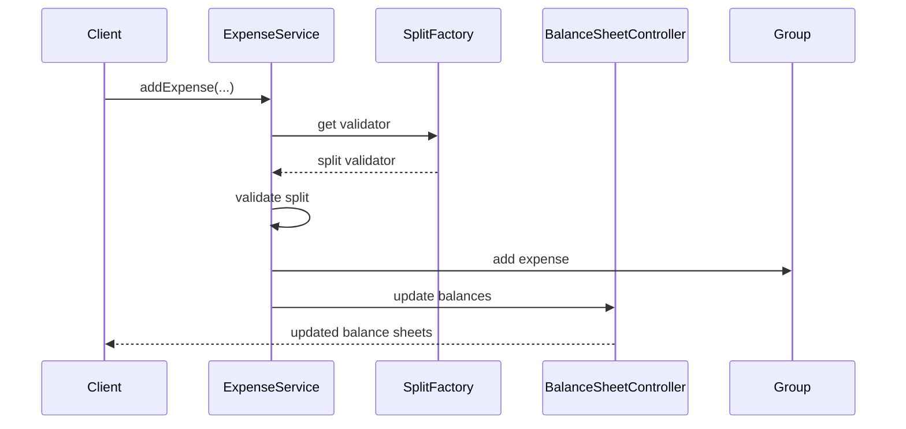

# Splitwise

This package started from the imported GitLab reference and was then simplified into a cleaner 1-hour LLD version here:

- `/Users/sajalagrawal/Documents/LLD/src/main/java/splitwise`

## Goal

Build a Splitwise-style system that is easy to explain and easy to code in an interview.

## What I Optimized

- removed unnecessary coupling from `Group`
- moved expense creation flow into a dedicated service
- replaced list-based lookups with map-based lookups for users and groups
- kept the model small enough to build in around 1 hour
- added validation for equal and unequal splits
- intentionally kept percentage split out of scope for the 1-hour version because current `Split` model only carries amount, not percentage

## Final Modules

- `user`
  - `User`
  - `UserController`
- `group`
  - `Group`
  - `GroupController`
- `expense`
  - `Expense`
  - `ExpenseService`
  - `ExpenseSplitType`
  - `SplitFactory`
- `expense/split`
  - `Split`
  - `ExpenseSplit`
  - `EqualExpenseSplit`
  - `UnequalExpenseSplit`
  - `PercentageExpenseSplit`
- root package
  - `Balance`
  - `UserExpenseBalanceSheet`
  - `BalanceSheetController`
  - `Splitwise`
  - `Main`

## How To Remember The Design

Remember Splitwise in this order:

1. users hote hain
2. groups optional hote hain
3. expense create hota hai
4. splits batate hain kisne kitna owe karna hai
5. balance sheet update hoti hai

Simple memory line:

`Create users -> create group -> add expense -> validate split -> update balances`

## Core Entities

### `User`

- app ka user
- apni personal balance sheet rakhta hai

### `Group`

- sirf members aur expenses ka holder
- business logic ka owner nahi

### `Expense`

- one expense entry
- kisne pay kiya
- total amount
- split type
- split details

### `Split`

- ek user ko kitna amount owe karna hai

### `UserExpenseBalanceSheet`

- user ka overall summary
- total paid
- total owe
- total get back
- user-vs-user balances

## Services

### `UserController`

- users ko add/get karta hai
- map use karta hai for O(1)-style lookup

### `GroupController`

- groups ko create/get karta hai
- map use karta hai for O(1)-style lookup

### `ExpenseService`

- expense creation ka main orchestration point
- split validate karta hai
- expense object banata hai
- group me add karta hai
- balance sheet update karta hai

### `BalanceSheetController`

- actual money settlement state update karta hai
- yahi core Splitwise logic hai

## Why This Version Is Better For LLD

### Earlier coupling

- `Group` khud `ExpenseController` banata tha
- `Group` ke andar expense creation logic chali ja rahi thi

### Now

- `Group` simple entity hai
- `ExpenseService` orchestration karta hai

This is easier to remember:

`Entity data hold karegi, service workflow handle karega`

## Interview-Friendly Scope

### In scope

- user add karna
- group create karna
- equal split
- unequal split
- balance sheet update

### Intentionally simplified

- percentage split not fully modeled
- no debt simplification graph
- no persistent DB
- no settlement transactions

## How To Explain In Interview

You can say:

1. `User` keeps personal balance sheet.
2. `Group` is just a container of members and expenses.
3. `ExpenseService` handles expense creation.
4. `SplitFactory` gives split validator based on type.
5. `BalanceSheetController` updates bilateral balances.

## Sequence Flow

## Best Study Order

Read in this order:

1. `/Users/sajalagrawal/Documents/LLD/src/main/java/splitwise/expense/split/Split.java`
2. `/Users/sajalagrawal/Documents/LLD/src/main/java/splitwise/expense/Expense.java`
3. `/Users/sajalagrawal/Documents/LLD/src/main/java/splitwise/expense/ExpenseService.java`
4. `/Users/sajalagrawal/Documents/LLD/src/main/java/splitwise/BalanceSheetController.java`
5. `/Users/sajalagrawal/Documents/LLD/src/main/java/splitwise/Splitwise.java`

## Quick Hinglish Memory Trick

`Expense banao, split verify karo, balances update karo`

That is the whole Splitwise core.
