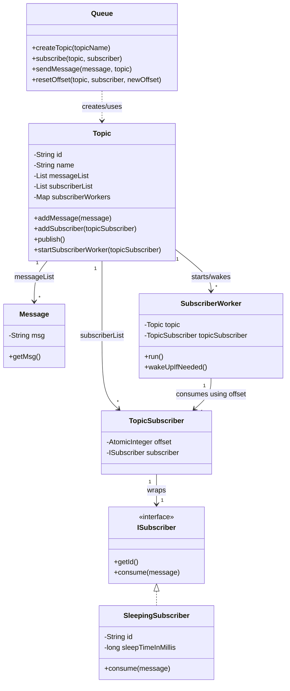
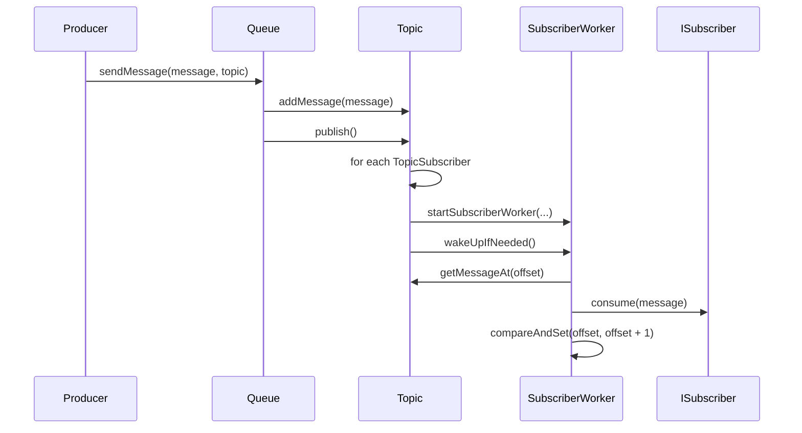
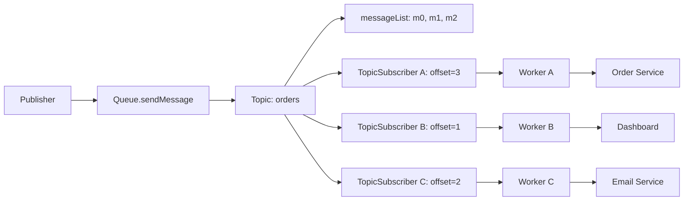
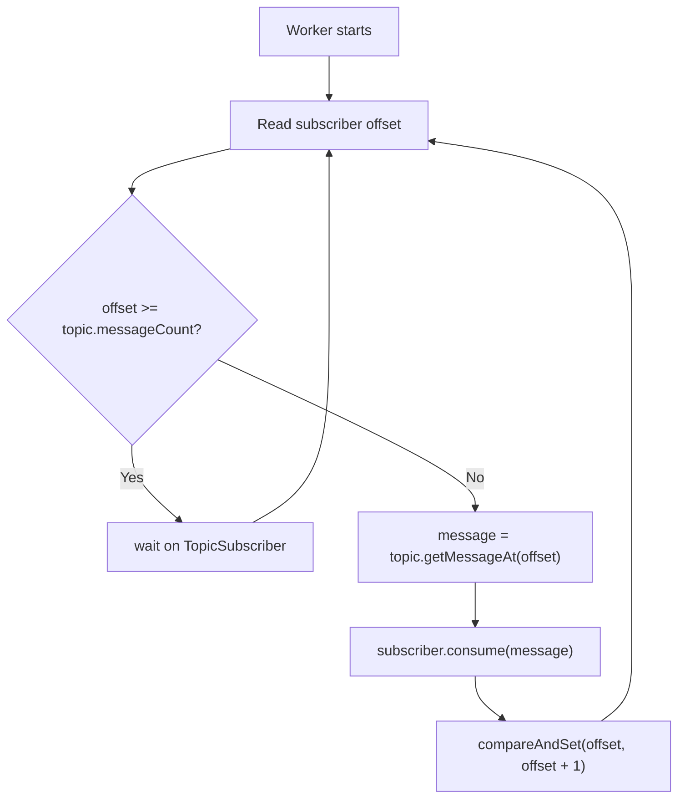
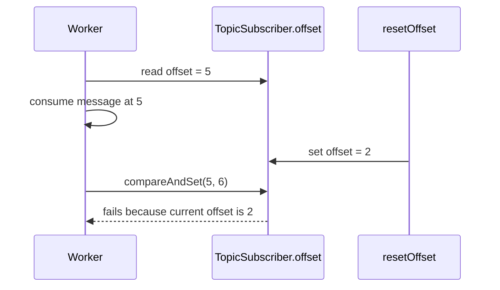

# Pub/Sub Memory Template - Easy Interview Version

1. Pehle hum `Queue` class banate hain, jo broker/Kafka jaisa entry point hai.

2. `queue.createTopic()` call karke ek `Topic` create hota hai, jiske andar `messageList`, `subscriberList`, aur subscriber workers ka map hota hai.

3. Phir hum `Subscriber` banate hain, jaise `SleepingSubscriber`.

4. `queue.subscribe(topic, subscriber)` call karke subscriber ko topic ke saath attach kar dete hain.

5. Internally subscriber ko `TopicSubscriber` wrapper me store kiya jata hai, jisme actual subscriber ke saath uska `offset` bhi hota hai.

6. Jab publisher `queue.sendMessage(message, topic)` call karta hai, toh pehle message topic ke `messageList` me append hota hai.

7. Message save hone ke baad topic ka `publish()` call hota hai.

8. `publish()` har `TopicSubscriber` ke liye ek `SubscriberWorker` thread start karta hai ya existing worker ko wake karta hai.

9. Har subscriber ka apna worker hota hai, isliye slow subscriber baaki subscribers ko block nahi karta.

10. Worker ke andar continuous `run()` loop hota hai.

11. Worker subscriber ka current `offset` check karta hai.

12. Agar `offset >= topic.messageCount()` hai, matlab new message nahi hai, toh worker `wait()` kar jata hai.

13. Publish ke baad worker ko `notifyAll()` milta hai.

14. Worker wake hota hai, apne offset par message pick karta hai, aur subscriber ka `consume()` call karta hai.

15. Successful consume ke baad worker `compareAndSet(oldOffset, oldOffset + 1)` se offset increment karta hai.

16. `compareAndSet` isliye use hota hai taaki agar beech me `resetOffset()` hua ho, toh worker galti se reset value overwrite na kare.
17. 
## Why This Folder Exists
Yeh folder ek short, yaad-rakhne-wala implementation hai. Iska goal production-grade code nahi hai; goal hai interview me jaldi se LLD structure recall karna.

This is the common template:
- `Message`
- `Topic`
- `TopicSubscriber`
- `ISubscriber`
- `Queue`
- `SubscriberWorker`

## One-Line Intuition
Topic ek message log hai. Har subscriber ke paas apna offset hai. Publish ke baad worker ko wake up karo. Worker offset se messages consume karta rahega.

## Diagram 1 - Class Memory Map



Yaad rakhne ka shortcut:

```text
Queue -> Topic -> SubscriberWorker
Topic -> Messages + TopicSubscribers + Workers
TopicSubscriber -> Subscriber + Offset
```

## Diagram 2 - Publish Flow



Simple intuition:

```text
publish = append message + wake workers
consume = read by offset + increment offset
```

## Diagram 3 - One Topic, Many Subscribers



Is diagram ka core point:

```text
messages same hain, offsets alag-alag hain
```

## Diagram 4 - Worker Loop



Interview line:

```text
Worker tab tak wait karta hai jab tak uske offset par message available na ho.
```

## Diagram 5 - Reset Offset Why `compareAndSet` Matters



Matlab:

```text
resetOffset ko accidentally overwrite nahi karna.
Isliye offset++ nahi, compareAndSet(oldOffset, oldOffset + 1).
```

## Class Memory Trick

### `Message`
Bas payload wrapper.

```text
Message = actual data
```

### `Topic`
Topic ke andar:
- `id`
- `name`
- `messageList`
- `subscriberList`
- `subscriberWorkers`

```text
Topic = message log + subscriber list + worker map
```

### `TopicSubscriber`
Subscriber wrapper hai.

```text
TopicSubscriber = subscriber + offset
```

Offset isliye yahan hai kyunki same topic par har subscriber different speed se consume kar sakta hai.

### `ISubscriber`
Consumer contract.

```text
getId()
consume(message)
```

### `Queue`
Broker/API layer.

```text
createTopic
subscribe
sendMessage
resetOffset
```

### `SubscriberWorker`
Actual consuming loop.

```text
while true:
    offset dekho
    agar message nahi hai -> wait
    message consume karo
    offset compareAndSet se increment karo
```

## Important Logic To Remember

### 1. Why one offset per subscriber?
Har subscriber apni speed se consume karega. Slow subscriber fast subscriber ko block nahi karna chahiye.

```text
same topic, same messages, different offsets
```

### 2. Why worker waits?
Agar current offset topic ke message count ke equal ya zyada hai, iska matlab new message nahi hai.

```text
offset >= messages.size => wait
```

### 3. Why notify after publish?
Publish ke baad sleeping workers ko batana padega ki new message aa gaya.

```text
sendMessage -> addMessage -> topic.publish -> worker.notify
```

### 4. Why `compareAndSet` after consume?
Reset offset parallel me ho sakta hai. Agar worker simple `offset++` karega, toh reset overwrite ho sakta hai.

Example:
```text
worker consuming offset 5
admin reset offset to 2
worker finishes and does offset++ blindly -> offset 6
wrong
```

Correct:
```text
compareAndSet(5, 6)
```

Matlab increment tabhi karo jab offset abhi bhi wahi hai jo consume start karte time tha.

## Flow

```text
Queue.createTopic("orders")
Queue.subscribe(orders, subscriber)
Queue.sendMessage(message, orders)
Topic.addMessage(message)
Topic.publish()
SubscriberWorker wakes up
SubscriberWorker consumes from subscriber offset
SubscriberWorker increments offset
```

## What This Supports
- Multiple topics.
- Multiple subscribers per topic.
- Async dispatch using threads.
- One worker per subscriber.
- Per-subscriber offset.
- Reset offset.
- Ordered delivery per subscriber.

## What This Does Not Handle
- Backpressure.
- Bounded memory.
- Retry/DLQ.
- Shutdown lifecycle.
- Consumer groups.
- Partitioning.

For a cleaner phased and more complete version, see:
- `src/main/java/pubsubsystem/phase1`
- `src/main/java/pubsubsystem/phase2`
- `src/main/java/pubsubsystem/phase3`

## Run

```bash
javac -d /tmp/pubsub-memory src/main/java/pubsubmemorytemplate/*.java
java -cp /tmp/pubsub-memory pubsubmemorytemplate.MemoryTemplateDemo
```
